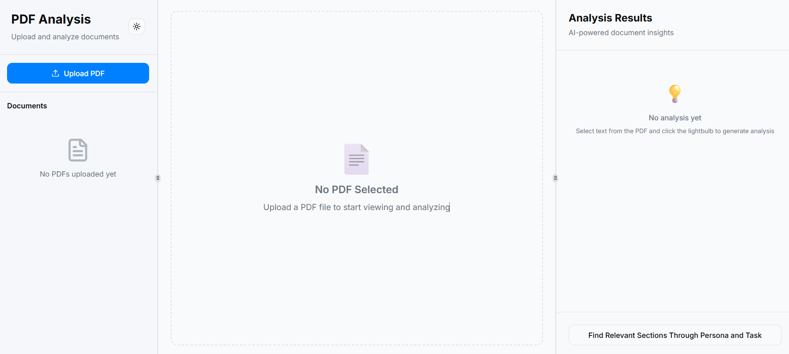
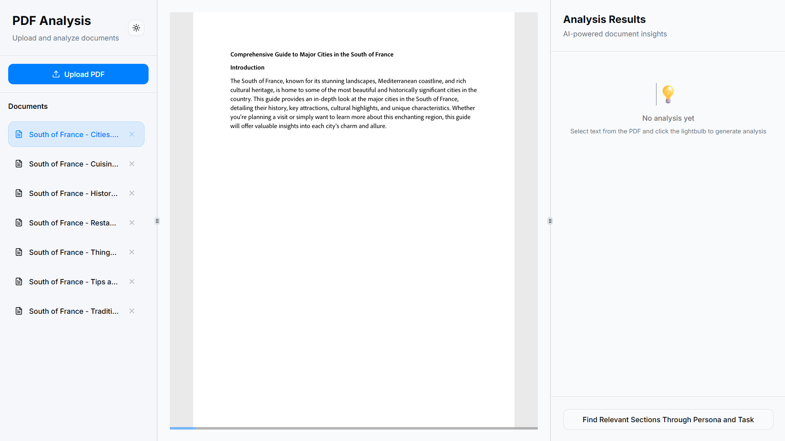
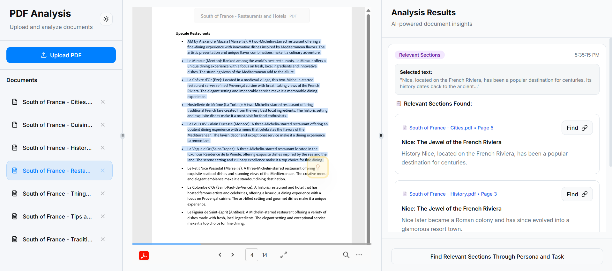
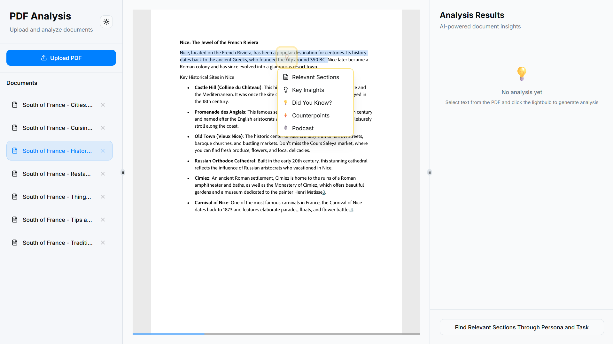
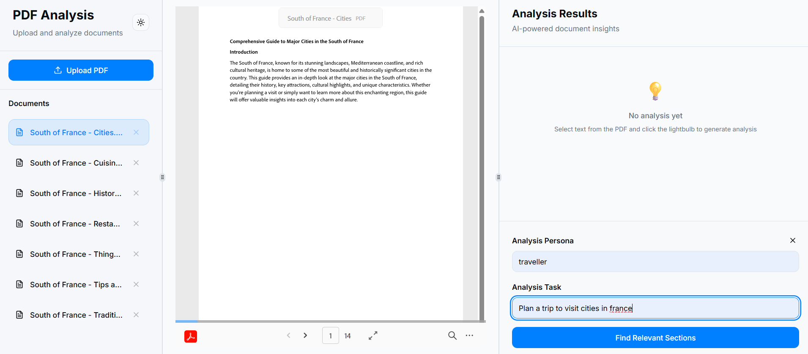
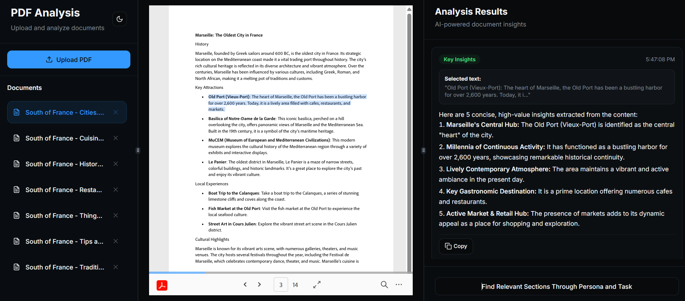

# AI-Powered PDF Analysis and Insights Platform 🚀

This repository contains the source code for an **AI-powered platform** developed for the **Adobe India Hackathon Final Round**. The application transforms the way users interact with PDF documents by allowing users to **upload multiple PDFs**, analyze their content using **state-of-the-art AI models**, and extract **insights, summaries, and even generate podcasts** from selected text.  

Designed for **researchers, students, and professionals**, this tool helps quickly understand and synthesize information from multiple documents. Leveraging **Large Language Models (LLMs)**, it goes beyond simple keyword searches to provide a **deep, contextual understanding** of the content, highlighting relevant sections and generating actionable insights.


## 🏛️ Architecture

The application is built with a modern, decoupled architecture, consisting of a React frontend and a FastAPI backend. The diagram below illustrates the high-level architecture of the system:

```
+-----------------+      +----------------------+      +--------------------+
|                 |      |                      |      |                    |
|  React Frontend |----->|    FastAPI Backend   |----->|   Google Gemini    |
| (Vite + TS)     |      | (Python)             |      |   (LLM)            |
|                 |      |                      |      |                    |
+-----------------+      +----------------------+      +--------------------+
       |                        |         |                      |
       |                        |         |                      |
       v                        v         v                      v
+-----------------+      +----------------------+      +--------------------+
|                 |      |                      |      |                    |
|  User Interface |      | PDF Parsing & Mgmt   |      |  Text-to-Speech    |
| (shadcn/ui)     |      | (PyMuPDF)            |      |  (gTTS, Azure TTS) |
|                 |      |                      |      |                    |
+-----------------+      +----------------------+      +--------------------+
                                |         |
                                |         |
                                v         v
                         +----------------------+
                         |                      |
                         | Vector Database      |
                         | (FAISS)              |
                         |                      |
                         +----------------------+
```

## ✨ Features

This platform offers a rich set of features designed to make document analysis intuitive and powerful.



### 📂 Bulk PDF Upload and Management

-   **Upload Multiple PDFs**: select multiple PDF files at once.
-   **Centralized View**: All uploaded PDFs are displayed in a clean, organized sidebar.
-   **Easy Navigation**: Switch between different PDFs with a single click.
-   **Remove PDFs**: Easily remove PDFs you no longer need.



### 📖 Interactive PDF Viewer

-   **High-Fidelity Rendering**: PDFs are rendered accurately using the **Adobe PDF Embed API**, preserving the original layout and formatting. (Note: This requires an `ADOBE_EMBED_API_KEY` to be set in the environment variables.)
-   **Zoom and Pan**: Zoom in on details or pan around the document with ease.
-   **Text Selection**: Select text within the PDF to trigger AI-powered analysis.



### 💡 AI-Powered Insights

When you select text in a PDF, a "light bulb" icon appears, offering a menu of AI-powered actions:

-   **Find Relevant Sections**: Searches across all uploaded documents to find sections related to the selected text.
-   **Generate Key Insights**: Summarizes the selected text and extracts the most important points.
-   **Generate "Did You Know?" Facts**: Creates interesting and relevant facts based on the selected text.
-   **Generate Counterpoints**: Provides alternative viewpoints or arguments to the selected text.
-   **Generate Podcast**: Creates a podcast script from the selected text and generates an audio version.



### 🧑‍🤝‍🧑 Persona and Task-Based Analysis

-   **Define a Persona**: Specify a role (e.g., "Financial Analyst," "History Student").
-   **Define a Task**: Describe the goal (e.g., "Identify market trends," "Summarize the causes of World War II").
-   **Contextual Analysis**: The AI will analyze the documents from the perspective of the defined persona and task, providing highly relevant insights.




### 🎨 Dark/Light Theme Support

-   **Toggle Theme**: Switch between light and dark themes to suit your preference and reduce eye strain.



## 🛠️ Tech Stack

This project is built with a combination of modern technologies for the frontend, backend, and AI components.

### Backend

-   **[FastAPI](https://fastapi.tiangolo.com/)**: A modern, fast (high-performance) web framework for building APIs with Python 3.7+ based on standard Python type hints.
-   **[PyMuPDF](https://pymupdf.readthedocs.io/en/latest/)**: A high-performance Python library for data extraction, analysis, and management of PDF documents.
-   **[Sentence-Transformers](https://www.sbert.net/)**: A Python framework for state-of-the-art sentence, text, and image embeddings. For embedding, we use the `all-MiniLM-L6-v2` model.
-   **[FAISS](https://faiss.ai/)**: A library for efficient similarity search and clustering of dense vectors.
-   **[Google Gemini](https://deepmind.google/technologies/gemini/)**: A family of multimodal AI models from Google used for content generation and analysis.
-   **[gTTS](https://gtts.readthedocs.io/en/latest/)**: A Python library and CLI tool to interface with Google Text-to-Speech API.
-   **[LangChain](https://www.langchain.com/)**: A framework for developing applications powered by language models.

### Frontend

-   **[React](https://reactjs.org/)**: A JavaScript library for building user interfaces.
-   **[Vite](https://vitejs.dev/)**: A build tool that aims to provide a faster and leaner development experience for modern web projects.
-   **[TypeScript](https://www.typescriptlang.org/)**: A typed superset of JavaScript that compiles to plain JavaScript.
-   **[Tailwind CSS](https://tailwindcss.com/)**: A utility-first CSS framework for rapidly building custom user interfaces.
-   **[shadcn/ui](https://ui.shadcn.com/)**: A collection of re-usable components built using Radix UI and Tailwind CSS.
-   **[React Query](https://tanstack.com/query/v3/)**: A library for fetching, caching, and updating data in React applications.
-   **[Adobe Embed API](https://www.adobe.com/devnet-docs/dcsdk_io/index.html)**: Used to render and view PDFs interactively within the web application.

### Embedding Model: `all-MiniLM-L6-v2`  
- This is a **lightweight, high-performance sentence transformer** from the [Sentence-Transformers library](https://www.sbert.net/). It converts text into **dense vector embeddings** that capture semantic          meaning, enabling the platform to:  
- Perform **semantic search** across all uploaded PDFs.  
- Retrieve **relevant sections** based on contextual similarity rather than exact keywords.  
- Support **fast and efficient similarity computations** for real-time user queries.  
- Maintain **small memory footprint** while providing high accuracy for sentence-level embeddings.  


## ⚡ Setup & Usage

### 🔨 Build the Docker Image
Run in any terminal (bash, PowerShell, WSL, etc.)::
```bash
docker build --platform linux/amd64 -t adobe_pdf_analyzer .
```

### ▶️ Run the Container
**Note**: Do not run this command in Git Bash—it will not work. Use PowerShell, CMD, or Windows Terminal.:
```bash
docker run -v "path/to/json_file:/credentials" `
  -e ADOBE_EMBED_API_KEY=adobe_embed_api_key `
  -e LLM_PROVIDER=gemini `
  -e GOOGLE_APPLICATION_CREDENTIALS=/credentials/credential_file.json `
  -e GEMINI_MODEL=gemini-2.5-flash `
  -e TTS_PROVIDER=google `
  -e AZURE_TTS_KEY=azure_tts_key `
  -e AZURE_TTS_ENDPOINT=azure_tts_endpoint `
  -p 8080:8080 adobe_pdf_analyzer

```

✅ Running the above command will bring up the application accessible at:
👉 [http://localhost:8080](http://localhost:8080)

## ⚙️ Environment Variables

The following environment variables are required to run the application. You can set them in a `.env` file in the root directory or as system environment variables.

| Variable                           | Description                                                                                                | Example                                           |
| ---------------------------------- | ---------------------------------------------------------------------------------------------------------- | ------------------------------------------------- |
| `ADOBE_EMBED_API_KEY`              | Your API key for the Adobe PDF Embed API.                                                                  | `your_adobe_embed_api_key`                        |
| `LLM_PROVIDER`                     | The LLM provider to use. Currently, only `gemini` is supported.                                            | `gemini`                                          |
| `GOOGLE_APPLICATION_CREDENTIALS`   | The absolute path to your Google Cloud service account JSON key file.                                      | `/app/credentials/your-service-account-file.json` |
| `GEMINI_MODEL`                     | The specific Gemini model to use for analysis.                                                             | `gemini-1.5-flash`                                |
| `TTS_PROVIDER`                     | The text-to-speech provider to use. Can be `google` or `azure`.                                            | `google`                                          |
| `AZURE_TTS_KEY`                    | Your API key for the Azure Text-to-Speech service. (Required if `TTS_PROVIDER` is `azure`)                 | `your_azure_tts_key`                              |
| `AZURE_TTS_ENDPOINT`               | The endpoint for your Azure Text-to-Speech service. (Required if `TTS_PROVIDER` is `azure`)                | `https://your-region.tts.speech.microsoft.com/`   |

## 🔗 API Endpoints

The backend provides the following API endpoints:

-   **`POST /upload/`**: Uploads a single PDF file.
    -   **Request**: `multipart/form-data` with a `file` field containing the PDF.
    -   **Response**: `{"filename": "string", "path": "string"}`

-   **`POST /analyze/`**: Analyzes multiple documents based on a persona and task.
    -   **Request**: `multipart/form-data` with `input_json` and `files`.
    -   **Response**: A JSON object with the analysis results.

-   **`POST /analyze/text/`**: Finds relevant sections in all documents based on a selected text.
    -   **Request**: `multipart/form-data` with `input_json` containing the selected text.
    -   **Response**: A JSON object with the relevant sections.

-   **`POST /generate_key_insights/`**: Generates key insights from a selected text.
    -   **Request**: `multipart/form-data` with `input_json` containing the selected text.
    -   **Response**: `{"key_insights": ["string"]}`

-   **`POST /did_you_know/`**: Generates "did you know" facts from a selected text.
    -   **Request**: `multipart/form-data` with `input_json` containing the selected text.
    -   **Response**: `{"did_you_know": ["string"]}`

-   **`POST /generate_contradictions/`**: Generates counterpoints from a selected text.
    -   **Request**: `multipart/form-data` with `input_json` containing the selected text.
    -   **Response**: `{"contradictions": ["string"]}`

-   **`POST /generate_podcast/`**: Generates a podcast from a selected text.
    -   **Request**: `multipart/form-data` with `input_json` containing the selected text.
    -   **Response**: `{"podcast_script": "string", "podcast_file": "string"}`

-   **`GET /get_audio/{filename}`**: Retrieves a generated podcast audio file.
    -   **Request**: The filename of the audio file.
    -   **Response**: The audio file as `audio/mpeg`.

## 📁 Project Structure

The project is organized into the following directory structure:

```
.
├── app/                  # Backend FastAPI application
│   ├── main.py           # API endpoints and main application logic
│   ├── analyzer.py       # Semantic search and analysis functions
│   ├── document_utils.py # PDF parsing and text processing
│   └── models.py         # Loading AI/ML models
├── frontend/             # Frontend React application
│   ├── src/
│   │   ├── components/   # Reusable UI components
│   │   ├── pages/        # Main pages of the application
│   │   ├── App.tsx       # Main application component
│   │   └── main.tsx      # Entry point for the React application
│   ├── public/           # Static assets
│   └── package.json      # Frontend dependencies and scripts
├── models/               # Pre-trained models
├── input/                # Uploaded PDF files
├── output/               # Generated files (e.g., podcasts)
├── utils/                # Utility scripts
├── Dockerfile            # Docker configuration
└── requirements.txt      # Python dependencies
```

## 🚀 Future Scope

This project has a solid foundation, and there are many exciting possibilities for future development:

-   **Advanced Semantic Search**: Implement a more advanced semantic search engine that can understand natural language queries and search across the entire content of all uploaded documents.
-   **Multi-lingual Support**: Add support for analyzing documents in multiple languages.
-   **Collaborative Features**: Allow multiple users to collaborate on the same set of documents, share annotations, and listen to podcasts together.
-   **User Authentication**: Implement a user authentication system to allow users to save their documents and analysis results.
-   **Support for More File Types**: Extend the application to support other document formats like `.docx`, `.pptx`, and `.txt`.
-   **Improved Podcast Generation**: Enhance the podcast generation feature with more voice options, background music, and sound effects.
-   **Integration with Other Services**: Integrate with other services like Zotero, Mendeley, or other research management tools.
